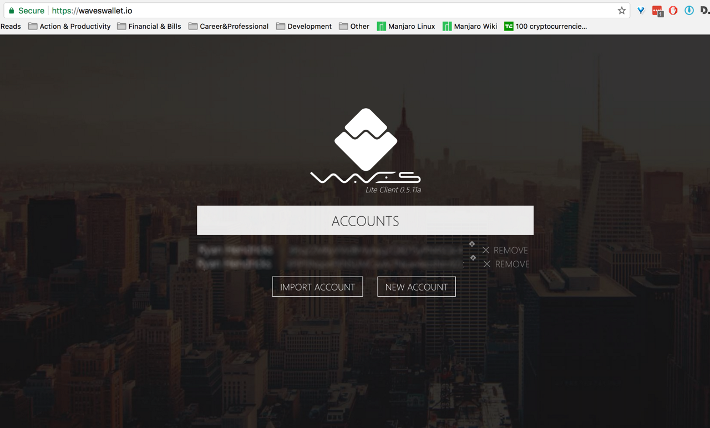

# Purchasing CoinHealth on the Waves Platform

## Login

This is the screen you should see when attempting to login to the Waves platform



## Dashboard

This is where to make deposits of the various options listed.


## Dex (buy and sell)

Click on the button in the menu bar that looks like two arrows pointed opposite ways.


## Purchase CoinHealth Tokens

```
GGuigYJDs3xoqmr4mGpLAguoEU6CfqTjb9qwk3YLCWRc
```

 Type in the asset ID (shown above) into one of the boxes on the screen. At that point there should be a drop-down which appears. Select the asset ID from the drop-down and it should populate in the text field.


 Please note, sometimes clicking on the dropdown cause it to close before the actual item was selected. If this happens just try again and it should work but you can always refresh your browser if the trouble persists.

## Further Guidance Coming Soon.

Here are links to some additional resources that may be helpful

[Deposit Funds into Waves Wallet](http://support.wavesplatform.com/forums/2-knowledge-base/categories/128-english-section/topics/_)

[Overview of Purchasing CoinHealth Tokens on the Waves Dex](http://support.wavesplatform.com/forums/2-knowledge-base/topics/2305-how-to-trade-tokens-on-the-dex/)