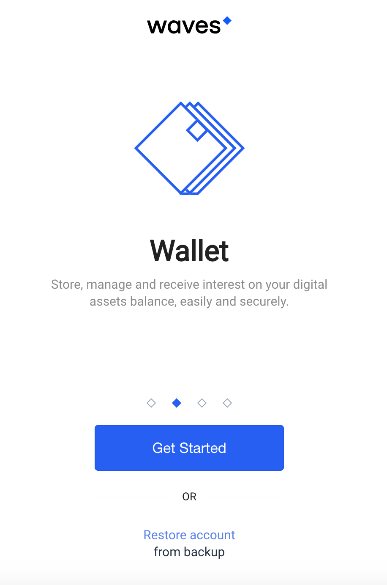
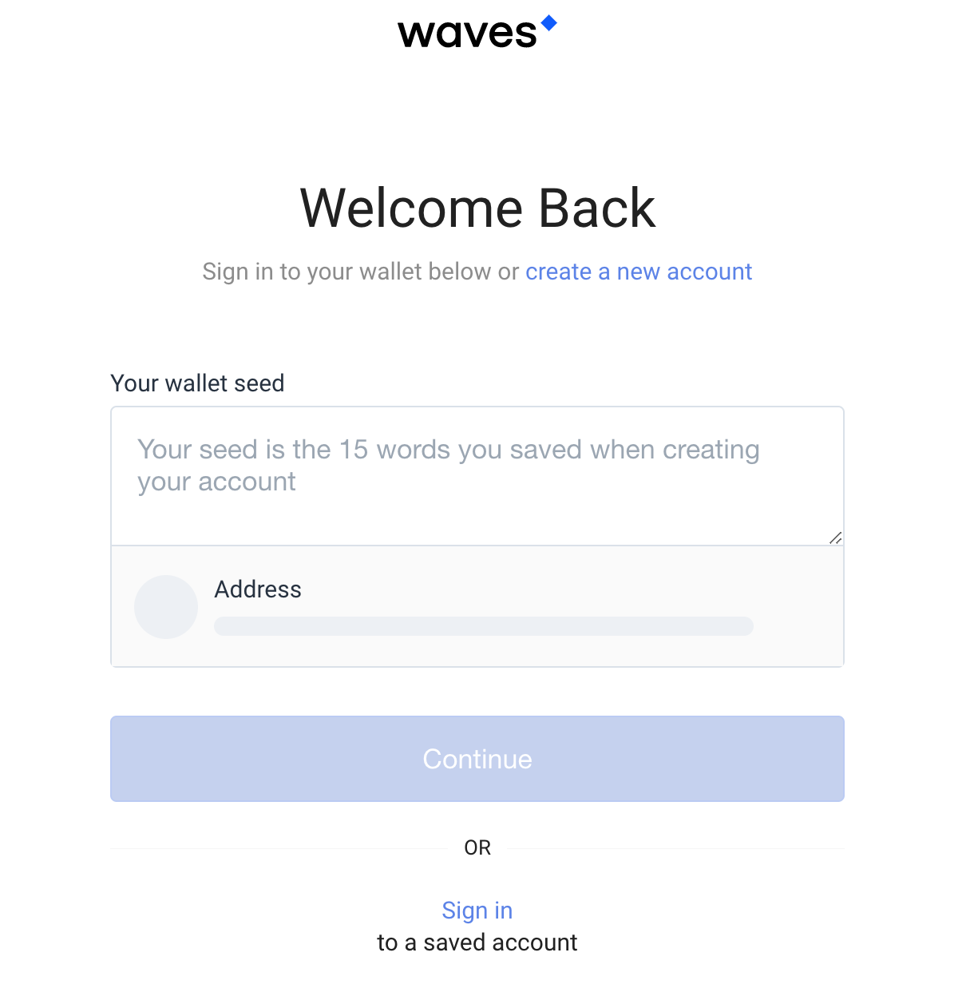
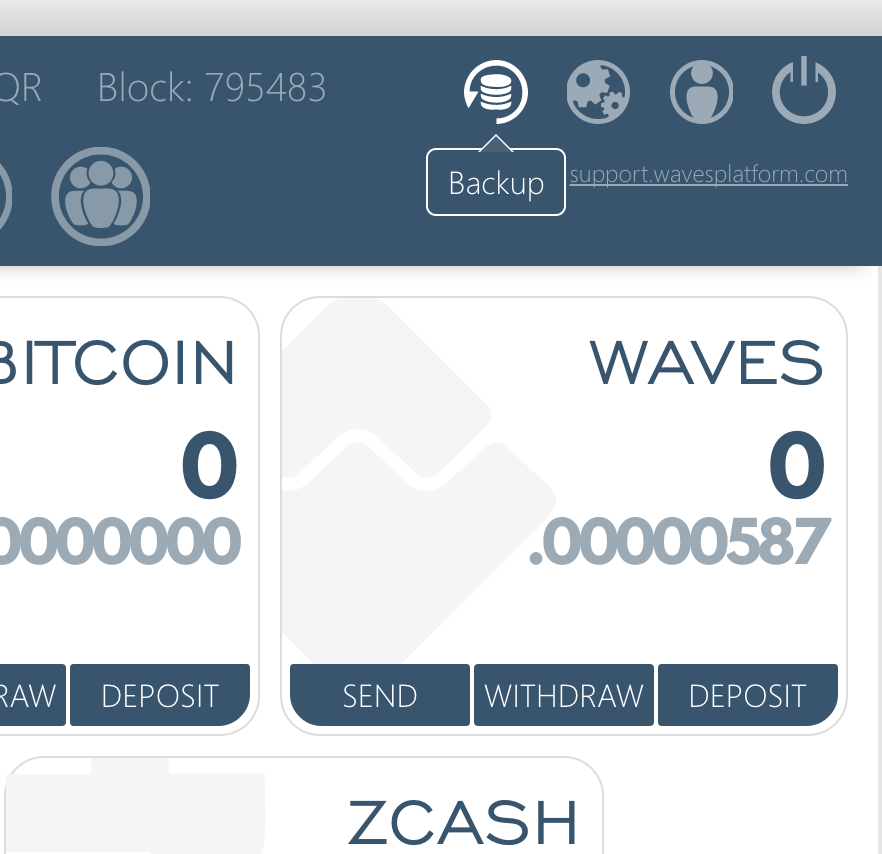
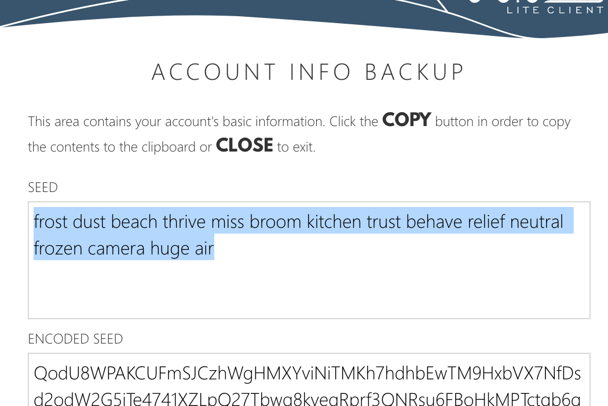
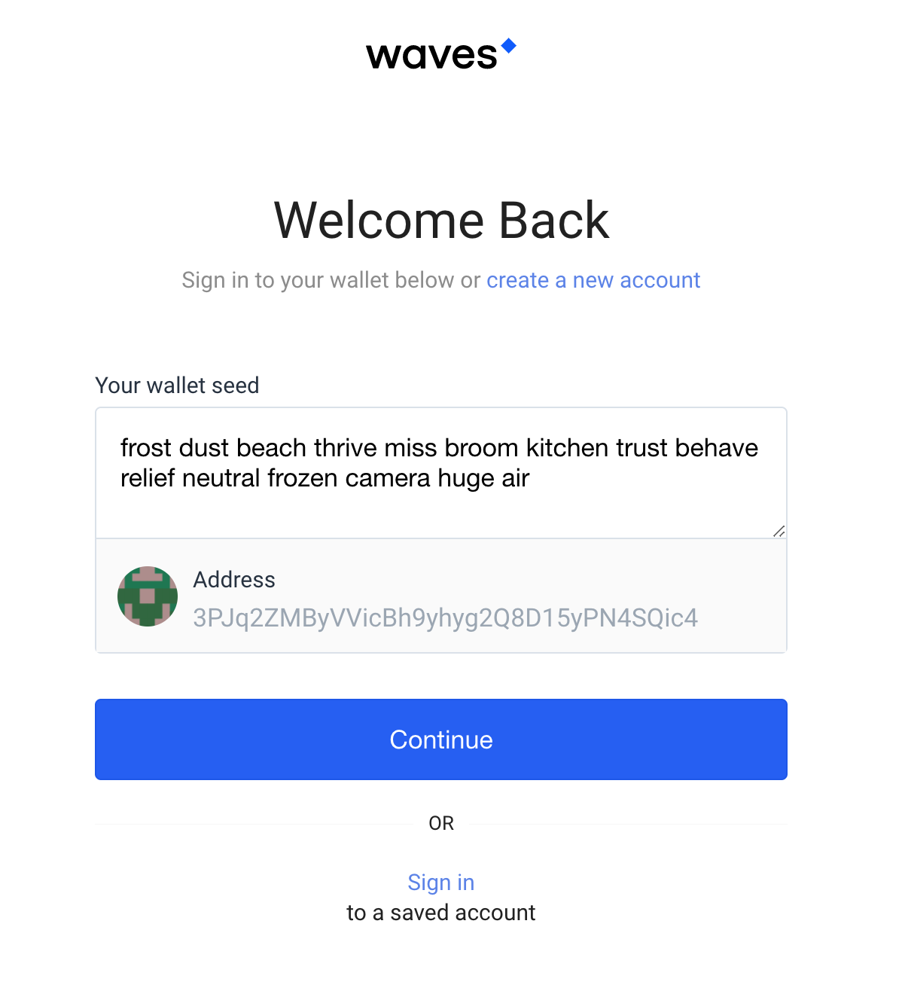
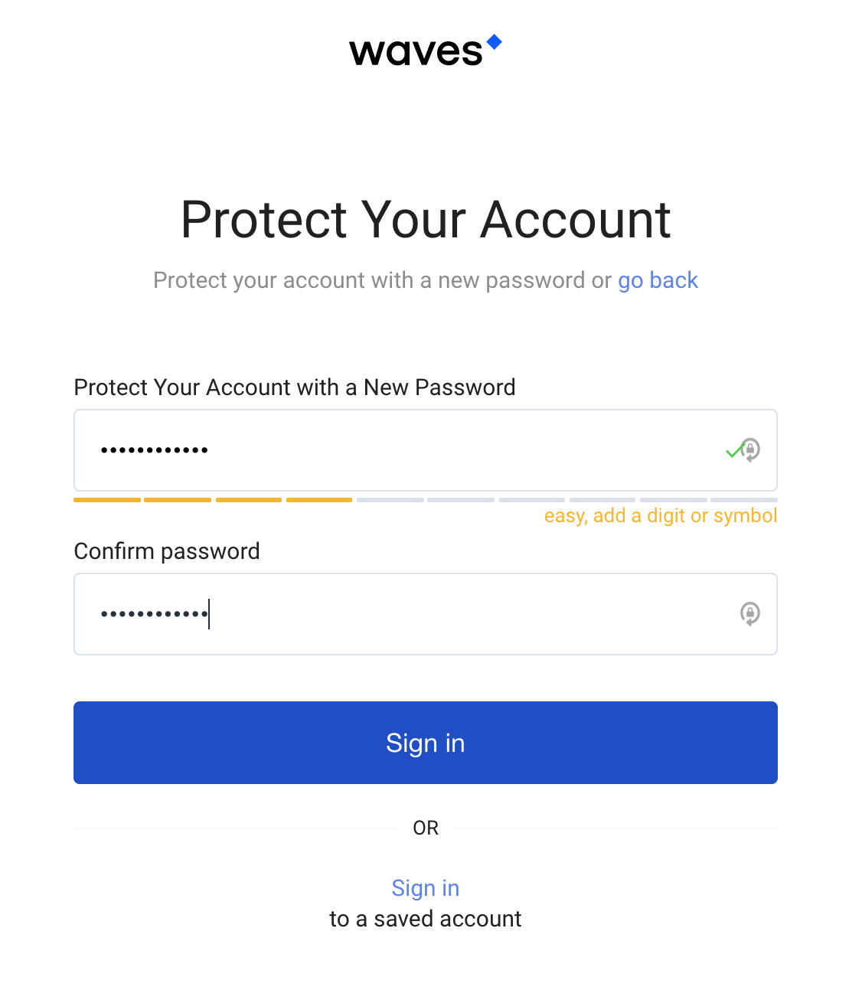

# Migrating to the New Waves Platform

## Restore from Backup

-----------

## Open the news waves platform [URL CLICKME](beta.wavesplatform.com) and you should see the following screen.

-----------

## Click on the "Restore Account" Link below the large blue botton. Next, you will be asked for your wallet seed phrase as shown below.

-----------

## You will need to obtain your seed phrase from your previous wallet. Open the old waves wallet platform, sign in to the account you wish to transfer, and click the backup button at the top right of the screen.

-----------

## Once you click the button you will be shown some works in the SEED box as shown. Yes, if you decide to steal the .00000587 Waves currently in this now comprimised account you have the ability to do so. The lesson here is DONT GIVE YOUR SEED PHRASE TO ANYONE. Instead, copy this SEED phrase and go back to the new waves wallet page.

-----------

## Back? Good, continue on. Paste the SEED phrase into the box asking for Your wallet seed. Click Continue.

-----------

## Choose a new password and confirm that new password in the text entry fields on the page.

**Congratulations. Your journey to the new waves platform is complete.**

*and yes there was a Star Wars reference there.*